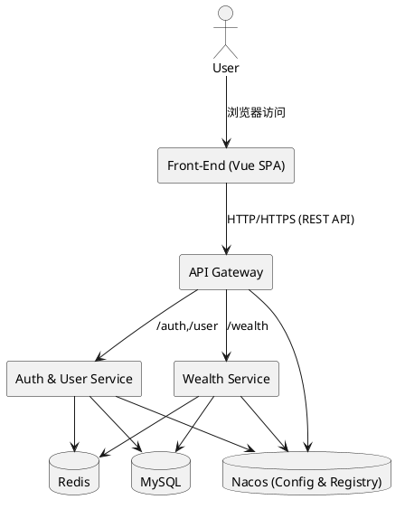
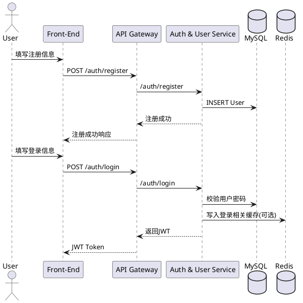
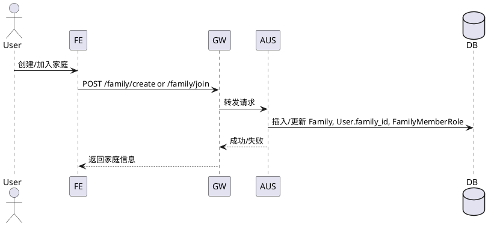
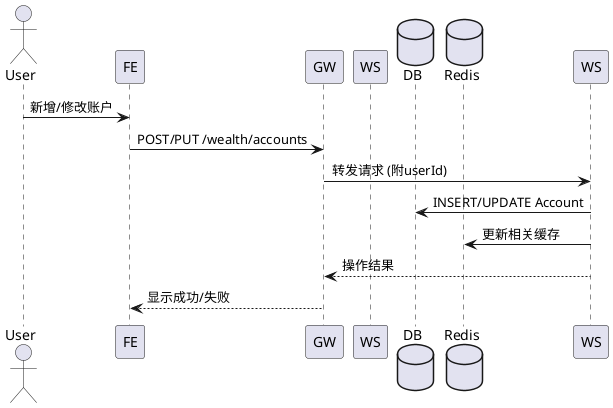
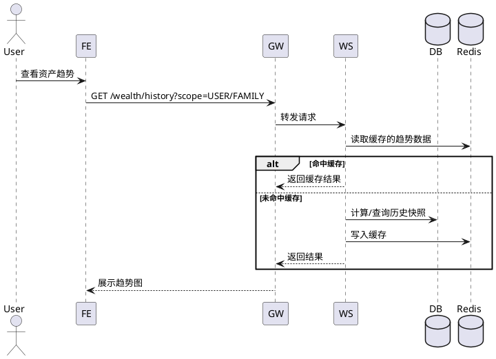
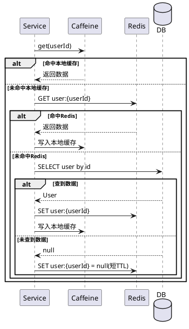

# house-hold

## 概要描述

创建一个 web 网站，前端使用 Vue，后端使用 Spring Cloud。支持的功能如下：

### 1、用户基本信息维护

- 1.1、支持用户注册登录，用户基本信息包括：用户名，密码，生日等
- 1.2、用户只能归属 1 个家庭，1 个家庭可以有多个用户；用户在家庭中可以有相应的角色，如丈夫，妻子等
- 1.3、家庭地址：国家，省份，城市，街道，家庭别名
- 1.4、用户可以创建家庭，也可以加入其他用户创建的家庭
- 1.5、家庭创建者自动成为户主，户主可指定其他成员为管理员
- 1.6、加入家庭支持两种方式：用户主动申请（管理员审批）/ 管理员按用户名邀请（用户确认）
- 1.7、管理员可以创建新用户并自动加入家庭，也可以移除成员

### 2、家庭财富维护

- 2.1 每个人可以维护自己当前的财富信息：账户，账户类型（信用卡，储蓄卡，股票，基金，支付宝，微信等），账户余额（其中信用卡维护当前账单金额）
- 2.2 支持自动汇总每个人的当前财富，也支持查询历史财富，及财富趋势
- 2.3 家庭自动汇总家庭中每个人的财富，也支持查询历史财富，及财富趋势
- 2.4 家庭共有资产管理：管理员可增删改家庭共有资产（房产、车辆、存款、投资等），所有成员可查询
- 2.5 家庭管理员可代管其他成员的个人资产账户（查看、新增、修改、删除）

### 3、缓存与存储

- 系统使用分布式三级缓存（本地缓存 Caffeine，分布式缓存 Redis，数据库 MySQL），需要支持用户分表
- 缓存要注意防缓存击穿、缓存穿透、缓存雪崩等

### 4、技术约束

- 用户基本信息维护和家庭财富维护分别是独立微服务，使用 Nacos 做配置中心，ORM 框架使用 MyBatis

---

## 概要设计文档

### 一、总体目标与范围

- **项目名称**：house-hold 家庭资产与成员管理系统
- **技术栈**：
  - **后端运行环境**：JDK 21；Spring Boot 3.3.x + Spring Cloud 2024.x（Leyton）+ Spring Cloud Alibaba（Nacos、OpenFeign、Gateway、Sentinel 可扩展）
  - **前端**：Vue 3 + TypeScript + Vue Router + Pinia + Axios + Element Plus + ECharts
  - **存储与缓存**：MySQL（ShardingSphere-JDBC 水平分表）、Redis（Redisson 客户端）、Caffeine（本地缓存），按「本地缓存 → Redis → MySQL」三级缓存策略；分布式场景使用 Redisson 分布式锁防缓存击穿
- **核心功能范围**：
  - **用户与家庭管理微服务**：注册登录、基本信息、家庭归属与角色、家庭地址、家庭创建/加入
  - **家庭财富管理微服务**：个人资产账户管理、家庭资产汇总、历史资产与趋势查询
  - **基础设施**：配置中心（Nacos）、注册中心（可共用 Nacos），统一网关与鉴权、日志与监控

### 二、系统角色与使用场景

- **角色**
  - **户主**：创建家庭的用户，拥有最高管理权限，可指定/取消管理员
  - **家庭管理员**：由户主指定，可管理成员（邀请、创建、移除）、审批加入申请、管理家庭共有资产、代管成员个人资产
  - **家庭成员**：普通家庭成员，管理自己的信息与资产，查看家庭级别资产概况和共有资产
  - **系统管理员（后台角色，后期可扩展）**：管理系统配置、监控服务状态、处理异常数据等
- **典型使用场景**
  - 用户注册并登录 → 创建家庭（成为户主）或申请加入家庭 → 维护个人资产账户 → 查看个人资产变化趋势 → 查看家庭总资产与历史趋势
  - 户主指定管理员 → 管理员邀请用户 / 审批加入申请 → 管理家庭共有资产 → 代管成员账户

### 三、系统架构设计

#### 3.1 高层架构

- **前端 Web 应用**（单页应用 SPA）
  - 通过 **API Gateway** 调用后端各微服务
  - 负责 UI 展示、路由控制、状态管理与交互逻辑
- **后端微服务**
  - **house-hold-common**（公共模块）：雪花算法 ID 生成器、公共业务异常、统一错误响应构建器、Caffeine 缓存配置、Redisson 依赖（分布式锁 + 会话管理）、`FamilyAdminChecker`（跨服务管理员权限校验）
  - **auth-user-service**（用户与家庭服务）：用户注册、登录、信息维护；家庭信息维护（家庭创建、加入家庭、家庭地址、成员角色等）
  - **wealth-service**（家庭财富服务）：个人账户管理、家庭财富汇总与统计；历史资产快照与趋势计算
  - **api-gateway**（网关服务）：统一入口、路由转发、鉴权（JWT/Token）、限流等
  - **config/registry**：Nacos 作为配置中心与服务发现
- **支撑组件**
  - MySQL：用户与财富业务数据存储
  - Redis：分布式缓存层（用户信息、账户信息、聚合结果、会话）
  - Caffeine：本地缓存（热点数据）
  - Spring Boot Actuator + Micrometer/Prometheus（健康检查与监控指标）
  - Logback 结构化日志（dev 彩色控制台 / prod JSON）+ MDC 请求追踪

#### 3.1.1 Maven 模块结构

```
house-hold/                          (父 POM)
├── house-hold-common/               公共模块（雪花算法、异常、缓存配置）
├── house-hold-gateway/              API 网关
├── house-hold-auth-user/            用户与家庭微服务（依赖 common）
├── house-hold-wealth/               财富管理微服务（依赖 common）
└── house-hold-web/                  前端（Vue 3 + TypeScript）
```

#### 3.2 系统组件关系图（PlantUML）



### 四、前端设计

#### 4.1 信息架构（页面与路由）

- **未登录区域**：`/login` 登录页、`/register` 注册页
- **登录后主框架**：
  - `/dashboard` 概览页（家庭/个人总览卡片）
  - `/profile` 用户个人信息页
  - `/family` 家庭信息与成员管理页（管理员面板：邀请、创建成员、审批、管理员设置）
  - `/family/assets` 家庭共有资产管理页（管理员 CRUD + 成员查看）
  - `/wealth/accounts` 个人账户列表与编辑页（管理员可切换查看/管理其他成员账户）
  - `/wealth/history` 历史资产与趋势图页
  - `/settings` 设置（基础偏好，后期拓展）

#### 4.2 页面与功能说明

- **登录页 `/login`**：用户名/邮箱、密码；登录、跳转注册、记住我（可选）
- **注册页 `/register`**：用户名、密码、确认密码、生日、邮箱（可选）、手机（可选）；注册后自动登录或跳转登录页
- **概览页 `/dashboard`**：个人当前总资产、家庭当前总资产、最近一次资产变动；简要折线图：最近 30 天个人/家庭资产趋势
- **个人信息页 `/profile`**：用户名、生日等基础信息查看与编辑；所属家庭信息只读展示
- **家庭页 `/family`**：当前家庭信息（国家、省份、城市、街道、家庭别名）；成员列表（姓名、角色、加入时间）；创建家庭/加入家庭、编辑家庭地址
- **个人账户页 `/wealth/accounts`**：账户列表（账户名称、类型、当前余额）；新增/编辑/删除账户
- **财富历史与趋势页 `/wealth/history`**：时间维度选择（日/周/月）；个人/家庭资产总额随时间变化折线图

#### 4.3 前端技术细节

- **状态管理**：`authStore`（登录状态、当前用户信息含家庭 ID）、`familyStore`（家庭信息与成员列表）、`wealthStore`（账户列表、当前总资产、历史数据缓存）
- **接口调用规范**：统一 `apiClient`（Axios 封装）；请求头附带 `Authorization: Bearer <token>`；错误拦截统一提示

### 五、后端设计

#### 5.1 服务划分与职责

- **house-hold-common**（公共模块）：各微服务共享的基础能力，包括：
  - **雪花算法 ID 生成器**（`SnowflakeIdGenerator`）：基于 Twitter Snowflake 的 64-bit 分布式唯一 ID，各服务通过不同 `datacenterId` + `workerId` 组合保证全局唯一
  - **公共业务异常**：`NotFoundException`（404）、`BadRequestException`（400）、`ForbiddenException`（403）、`ErrorResponseBuilder`（统一错误响应格式）
  - **公共缓存配置**：`CacheConfig`（Caffeine 本地缓存配置）、`BaseCacheProperties`（缓存属性基类）；Redis 由 Redisson Spring Boot Starter 自动配置
  - **Redisson 依赖**：统一引入 `redisson-spring-boot-starter`，提供 `RedissonClient`（分布式锁、会话管理、缓存读写）
- **auth-user-service**：用户注册、登录（返回 JWT）、登出（Redis Session 失效）；用户信息 CRUD；家庭信息 CRUD；用户与家庭绑定关系维护；对外暴露 REST API
- **wealth-service**：个人资产账户 CRUD；操作触发实时快照 + 定时任务（Spring Scheduler + Redisson 分布式锁）夜间批量快照；ShardingSphere-JDBC 对 account 表水平分表；家庭/个人资产汇总与趋势统计接口；对外暴露 REST API
- **api-gateway**：路由转发 `/auth`、`/user`、`/family`、`/wealth` 等前缀；统一鉴权（JWT 校验），将 userId + familyId 注入请求上下文（header）

#### 5.2 领域模型设计（简化）

> **ID 生成策略**：所有实体主键均使用雪花算法（Snowflake）生成 64-bit 分布式唯一 Long 型 ID，不依赖数据库自增。各服务通过不同 `datacenterId` + `workerId` 组合避免 ID 冲突：
>
> | 服务 | 实体 | datacenterId | workerId |
> |------|------|:---:|:---:|
> | auth-user-service | User | 1 | 1 |
> | auth-user-service | Family | 1 | 2 |
> | auth-user-service | FamilyMemberRole | 1 | 3 |
> | auth-user-service | FamilyJoinRequest | 1 | 4 |
> | wealth-service | Account | 2 | 1 |
> | wealth-service | WealthSnapshot | 2 | 2 |
> | wealth-service | FamilyAsset | 2 | 3 |

**用户与家庭领域**

- **User**：id, username, password_hash, birthday, email, phone, family_id (FK)
- **Family**：id, name_alias, country, province, city, street, created_by（户主用户ID）
- **FamilyMemberRole**：id, user_id (FK), family_id (FK), role (HUSBAND/WIFE/CHILD/OTHER), is_admin（是否管理员）
- **FamilyJoinRequest**：id, family_id, user_id, request_type (APPLY/INVITE), status (PENDING/APPROVED/REJECTED), initiated_by, handled_by, role

**财富领域**

- **Account**：id, user_id (FK), account_name, account_type (CREDIT_CARD, SAVING, STOCK, FUND, ALIPAY, WECHAT, …), balance, currency, created_at, updated_at
- **FamilyAsset**：id, family_id, asset_name, asset_type (REAL_ESTATE/VEHICLE/DEPOSIT/INVESTMENT/OTHER), amount, currency, remark, created_by
- **WealthSnapshot**：id, owner_type (USER/FAMILY), owner_id (user_id or family_id), total_amount, snapshot_date, created_at

#### 5.3 用户与家庭相关流程（PlantUML）

**用户注册与登录流程**



**创建/加入家庭流程**



#### 5.4 财富维护与统计流程（PlantUML）

**个人账户维护**



**资产汇总与趋势查询**



### 六、数据库与分表设计

- **单库多表**：所有服务共用 `household` 库
- **ShardingSphere-JDBC 水平分表**（迭代四）：`account` 表按 `user_id % 4` 分为 4 张物理表（`account_0` ~ `account_3`），ShardingSphere-JDBC 透明路由
- **未分表的表**：`user_base`、`family`、`family_member_role`、`family_join_request`、`wealth_snapshot`、`family_asset` 保持原样
- **分片键**：`user_id`；`findByUserId` 精确路由单表，`findByFamilyId` 广播查询 4 表
- **DDL 管理**：分表由手动 DDL 创建，JPA `ddl-auto` 设为 `none`（wealth 服务）

### 七、缓存设计（三级缓存策略）

#### 7.1 缓存对象与 Key 设计

- **本地缓存（Caffeine）**：热门只读数据（如某些配置、热门用户信息摘要）
- **Redis 缓存**：`user:{userId}`、`family:{familyId}`、`accounts:user:{userId}`、`wealth:summary:user:{userId}`、`wealth:summary:family:{familyId}`

#### 7.2 防缓存击穿/穿透/雪崩策略

- **缓存击穿**：使用 Redisson 分布式锁（`RLock`）控制回源，确保多实例部署下同一 key 只有一个线程穿透到数据库；本地 Caffeine 做兜底
- **缓存穿透**：对不存在的数据写入短期空值缓存（`__NULL__` 标记，短 TTL）；接口层做基本参数校验与限流
- **缓存雪崩**：不同 key 的 TTL 加随机偏移（如 baseTTL + random(0, 300) 秒）；预热与后台刷新策略

#### 7.3 访问缓存流程（PlantUML）

以查询用户信息为例：



### 八、安全与鉴权设计

- **登录与会话**：登录成功后返回 JWT，同时在 Redis 中创建会话记录（key: `household:session:{userId}`，value: token，TTL 与 JWT 过期时间一致）；前端存储 JWT 在 localStorage 或 cookie
- **登出**：调用 `POST /auth/logout`，服务端删除 Redis 中的会话记录，令 token 立即失效
- **网关校验（双重验证）**：
  1. 验证 JWT 签名与有效期
  2. 通过 Redisson 查询 Redis 会话，确认 token 与服务端存储一致（支持主动登出、踢人等场景）
  3. 校验通过后将 userId、familyId 注入请求头传给下游服务
- **Redis 客户端**：全局统一使用 Redisson，缓存防击穿使用 Redisson 分布式锁（`RLock`）替代本地 `ReentrantLock`，支持多实例部署
- **数据访问控制**：用户只能访问自己相关数据；家庭级统计接口需校验用户是否属于该家庭；管理员操作通过 Redis Set（`family:admins:{familyId}`）跨服务验证权限
- **家庭管理员缓存**：auth-user 服务在管理员状态变更时维护 Redis Set，wealth 服务通过 `FamilyAdminChecker` 工具类（common 模块）读取判断权限，避免同步跨服务调用

### 九、非功能性需求

- **性能**：初期按小流量设计（如百级 QPS），架构可水平扩展；关键接口（登录、查询资产）响应时间目标 < 300ms
- **可用性**：Nacos + 多实例部署；Redis 哨兵/集群部署（设计时考虑，初期可单机）
- **可观测性**：Spring Boot Actuator 暴露 `/actuator/health`、`/actuator/prometheus` 端点；Logback 结构化日志（dev 彩色 / prod JSON）；RequestLoggingFilter + MDC traceId 全链路追踪；Gateway AccessLogGlobalFilter 记录路由与耗时
- **扩展性**：增加预算管理、记账流水、报表导出等新功能时，无需大改核心架构

### 十、开发迭代计划（建议）

- **迭代一：基础骨架**：前端项目初始化（Vue3+TS+Router+Pinia）、基础布局与登录注册页面；后端 Spring Cloud 工程结构、Nacos、网关、auth登录接口-user-service 雏形、注册
- **迭代二：用户与家庭管理**：用户信息维护、家庭创建/加入、家庭信息展示；初步接入 Cache（用户与家庭信息）
- **迭代三：财富管理**：账户 CRUD、资产汇总 API、历史趋势数据结构与存储；前端账户与趋势图展示页面
- **迭代四：优化与完善**：Spring Boot Actuator + Micrometer/Prometheus 监控；Logback 结构化日志 + MDC 请求追踪；Spring Scheduler + Redisson 分布式锁定时快照；ShardingSphere-JDBC account 表水平分表（4 分片）；前端全面引入 Element Plus + ECharts，UI/UX 全面重构
- **迭代五：家庭管理权限与共有资产**：家庭管理员体系（户主/管理员）；双向加入流程（申请审批/邀请确认）；管理员创建新用户并自动加入家庭；家庭共有资产模块（管理员 CRUD / 成员查看）；管理员代管其他成员个人资产；Redis Set 跨服务管理员权限校验
