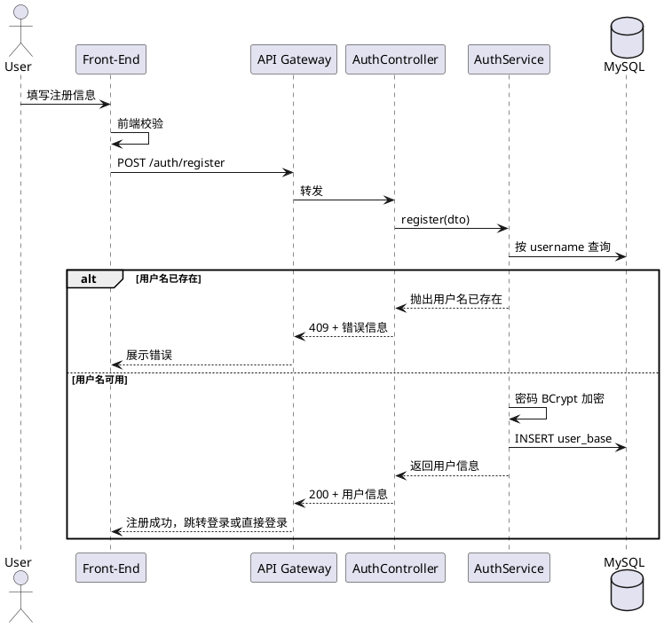
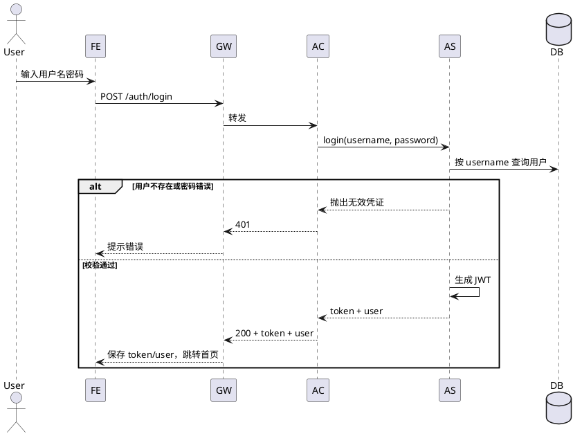

# 迭代一详细设计

## 一、迭代目标与范围

### 1.1 目标

搭建 house-hold 项目的前后端骨架，实现用户注册与登录闭环，为后续「用户与家庭管理」迭代提供可运行基础。

### 1.2 范围

| 类别     | 内容 |
|----------|------|
| 前端     | Vue 3 项目初始化（TypeScript、Vue Router、Pinia、Axios）；基础布局（含导航/未登录布局）；登录页、注册页；路由守卫与鉴权状态管理 |
| 后端     | Spring Cloud 父工程与模块划分；Nacos 配置中心/注册中心接入；API Gateway 搭建与路由；auth-user-service 雏形；用户注册、登录接口（含 JWT 签发） |
| 数据与缓存 | 用户表设计与建表；本迭代暂不强制接入 Redis/Caffeine，可为登录态预留 Redis 存储（可选） |

### 1.3 不纳入本迭代

- 家庭相关功能（创建家庭、加入家庭、家庭地址）
- 财富相关功能
- 三级缓存完整方案
- 用户分表实现

---

## 二、前端详细设计

### 2.1 技术选型与版本

| 技术       | 版本建议 | 说明 |
|------------|----------|------|
| Vue        | 3.4+     | Composition API |
| TypeScript | 5.x      | 严格模式 |
| Vue Router | 4.x      | 与 Vue 3 配套 |
| Pinia      | 2.x      | 状态管理 |
| Axios      | 1.x      | HTTP 客户端 |
| Vite       | 5.x      | 构建工具 |
| 其他       | -        | 可按需引入 UI 库（Element Plus / Naive UI / Ant Design Vue 等） |

### 2.2 项目目录结构

```
house-hold-web/
├── public/
├── src/
│   ├── api/              # 接口封装
│   │   ├── request.ts    # Axios 实例与拦截器
│   │   └── auth.ts       # 登录、注册接口
│   ├── assets/           # 静态资源
│   ├── components/       # 公共组件
│   │   ├── AppHeader.vue
│   │   └── AppLayout.vue # 登录后主布局（本迭代可为空壳）
│   ├── layouts/          # 布局
│   │   ├── GuestLayout.vue   # 未登录（登录/注册页用）
│   │   └── MainLayout.vue    # 登录后（预留）
│   ├── router/
│   │   └── index.ts      # 路由与导航守卫
│   ├── stores/
│   │   └── auth.ts       # 登录态、用户信息、token
│   ├── views/
│   │   ├── Login.vue     # 登录页
│   │   └── Register.vue  # 注册页
│   ├── types/            # 类型定义
│   │   └── auth.d.ts
│   ├── App.vue
│   └── main.ts
├── index.html
├── vite.config.ts
├── tsconfig.json
└── package.json
```

### 2.3 路由设计

| 路径        | 组件        | 说明           | 是否需要登录 |
|-------------|-------------|----------------|--------------|
| `/login`    | Login       | 登录页         | 否           |
| `/register` | Register    | 注册页         | 否           |
| `/`         | 重定向      | 已登录 → `/dashboard`，未登录 → `/login` | - |

- **导航守卫**：访问 `/login`、`/register` 时若已登录，可重定向至 `/` 或 `/dashboard`；访问需登录页面时若未登录，重定向至 `/login`。
- 本迭代 `/dashboard` 可仅为占位页（如展示“欢迎”+ 用户名）。

### 2.4 登录页（/login）

- **表单字段**
  - 用户名（或邮箱）：必填，文本
  - 密码：必填，密码框
  - 记住我：可选，复选框（前端可持久化 username，不持久化密码）
- **行为**
  - 提交调用 `POST /auth/login`，成功则保存 token 与用户信息到 Pinia + localStorage（或 cookie），并跳转至 `/` 或 `/dashboard`。
  - 校验失败或接口报错时，在页面上展示错误信息。
  - 提供「前往注册」链接至 `/register`。
- **校验**：前端非空校验；格式校验（如用户名长度）可选。

### 2.5 注册页（/register）

- **表单字段**
  - 用户名：必填，唯一，长度限制（如 4–32 字符）
  - 密码：必填，长度与强度建议（如 ≥6 位）
  - 确认密码：必填，与密码一致
  - 生日：必填，日期选择
  - 邮箱：选填
  - 手机：选填
- **行为**
  - 提交调用 `POST /auth/register`，成功后可自动登录（调用登录接口或后端直接返回 token）并跳转，或跳转至 `/login`。
  - 用户名已存在等错误在页面展示。
  - 提供「前往登录」链接至 `/login`。
- **校验**：前端必填、长度、两次密码一致、生日合法性等。

### 2.6 状态管理（Pinia authStore）

- **状态**
  - `token: string | null`
  - `user: { id: string; username: string; birthday?: string } | null`
- **方法**
  - `login(credentials)`：调用登录 API，写入 token、user，持久化（如 localStorage）
  - `register(payload)`：调用注册 API，按约定做登录或跳转
  - `logout()`：清空 token、user 与持久化
  - `loadFromStorage()`：应用启动时从 localStorage 恢复登录态（并可选校验 token 有效性）
- **持久化**：token 与 user 可存 `localStorage`，key 如 `household_token`、`household_user`。

### 2.7 接口封装（Axios）

- **BaseURL**：从环境变量读取（如 `VITE_API_BASE_URL`），默认指向 Gateway 地址（如 `http://localhost:8xxx`）。
- **请求拦截器**：为除登录/注册外的请求自动添加 `Authorization: Bearer <token>`。
- **响应拦截器**：统一处理 401（清除登录态并跳转登录页）、4xx/5xx 错误提示；业务错误码按约定解析并提示。
- **auth API**：`login(username, password)`、`register(body)`，对应后端的 `/auth/login`、`/auth/register`。

### 2.8 类型定义（示例）

```ts
// types/auth.d.ts
export interface LoginRequest {
  username: string;
  password: string;
}

export interface LoginResponse {
  token: string;
  user: { id: string; username: string; birthday?: string };
}

export interface RegisterRequest {
  username: string;
  password: string;
  birthday: string;  // 如 'YYYY-MM-DD'
  email?: string;
  phone?: string;
}

export interface RegisterResponse {
  id: string;
  username: string;
  birthday?: string;
  email?: string;
  phone?: string;
}
```

### 2.9 环境变量

| 变量名               | 说明           | 示例值                    |
|----------------------|----------------|---------------------------|
| VITE_API_BASE_URL    | 后端 API 基地址 | http://localhost:8080     |

---

## 三、后端详细设计

### 3.0 运行环境与基础版本

- **JDK**：21（LTS）
- **配套 Spring 体系**：以 JDK 21 为基础，采用 Spring Boot 3.3.x + Spring Cloud 2024.x 配套组合。

### 3.1 工程与模块结构

- **父工程**：`house-hold`（pom packaging 为 `pom`），管理依赖版本与子模块。
- **子模块**
  - `house-hold-gateway`：Spring Cloud Gateway，对外端口如 8080。
  - `house-hold-auth-user`：用户与家庭服务（本迭代仅实现注册、登录），端口如 8081。
  - 可选：`house-hold-common`（公共 DTO、工具、常量）。

```
house-hold/
├── pom.xml
├── house-hold-gateway/
│   └── pom.xml
├── house-hold-auth-user/
│   └── pom.xml
└── house-hold-common/   (可选)
    └── pom.xml
```

### 3.2 依赖与版本（父 pom 统一管理）

| 技术 | 版本 | 说明 |
|------|------|------|
| JDK | 21 | 运行与编译版本，父 pom 中 `java.version` / `maven.compiler.source` 设为 21 |
| Spring Boot | 3.3.x | 与 JDK 21、Spring Cloud 2024.x 配套，建议 3.3.5 或以上 |
| Spring Cloud | 2024.0.x（Leyton） | 与 Spring Boot 3.3.x 配套 |
| Spring Cloud Alibaba | 2023.0.x | Nacos、Gateway 等，兼容 Spring Boot 3.3 |
| MyBatis / MyBatis-Spring-Boot-Starter | 3.0.x | 兼容 Spring Boot 3 |
| MySQL Connector | 8.x | 与 MySQL 8 配套 |
| JWT | jjwt 0.12.x | 适配 Java 21 |
| Lombok、spring-boot-starter-validation | 随 Spring Boot | - |

- 父 pom 中建议使用 `properties` 统一管理：`java.version`、`spring-boot.version`、`spring-cloud.version`、`spring-cloud-alibaba.version`，子模块继承。

### 3.3 Nacos

- **用途**：配置中心 + 服务发现（本迭代至少完成配置中心，便于后续扩展）。
- **auth-user 服务**：在 Nacos 中创建命名空间或组，配置文件如 `house-hold-auth-user.yaml`，内容包含：
  - `spring.datasource.*`（MySQL）
  - 服务端口、应用名
  - 其他业务配置（如 JWT 密钥、过期时间）。
- **Gateway**：可从 Nacos 读取路由配置或在本机配置路由；本迭代可在 Gateway 本地配置路由与 Nacos 地址。

### 3.4 API Gateway

- **端口**：8080（与前端 `VITE_API_BASE_URL` 一致）。
- **路由规则**（示例）：
  - 路径前缀 `/auth/**` → 转发至 `house-hold-auth-user` 服务（如 `lb://house-hold-auth-user`），路径保留 `/auth/**`。
- **放行**：`/auth/login`、`/auth/register` 不校验 JWT；其余 `/auth/**` 及后续其他前缀在迭代二可增加 JWT 校验，本迭代可全部放行或仅做占位。
- **CORS**：配置允许前端源（如 `http://localhost:5173`）、允许携带凭证与常用方法/头。

### 3.5 auth-user-service 详细设计

#### 3.5.1 应用名与端口

- `spring.application.name`: `house-hold-auth-user`
- 端口：8081（避免与 Gateway 冲突）

#### 3.5.2 包结构

```
house-hold-auth-user/
├── controller/
│   └── AuthController.java    # 注册、登录接口
├── service/
│   └── AuthService.java
├── mapper/
│   └── UserMapper.java       # MyBatis
├── entity/
│   └── User.java
├── dto/
│   ├── request/
│   │   ├── LoginRequest.java
│   │   └── RegisterRequest.java
│   └── response/
│       ├── LoginResponse.java
│       └── RegisterResponse.java
├── config/
│   └── JwtConfig.java        # JWT 生成与校验（本迭代仅生成）
├── util/
│   └── JwtUtil.java
└── HouseHoldAuthUserApplication.java
```

#### 3.5.3 注册接口

- **路径**：`POST /auth/register`
- **请求体**：见下方接口契约。
- **逻辑**：
  1. 参数校验（用户名、密码、生日等）。
  2. 查库判断用户名是否已存在；若存在返回 4xx 及明确错误码/文案。
  3. 密码加密存储（BCrypt）。
  4. 插入 `user_base` 表，生成 id（雪花或 UUID）。
  5. 返回用户信息（不含密码）；可选：同时签发 JWT 并返回 token（则前端可直接登录态）。
- **异常**：用户名重复、参数不合法等返回统一错误结构。

#### 3.5.4 登录接口

- **路径**：`POST /auth/login`
- **请求体**：见下方接口契约。
- **逻辑**：
  1. 根据用户名查询用户。
  2. 若不存在，可返回「用户名或密码错误」（不暴露是否用户名不存在）。
  3. 使用 BCrypt 校验密码；失败则同上。
  4. 生成 JWT（payload 含 userId、username、过期时间等），可选将 token 或 session 写入 Redis（本迭代可省略）。
  5. 返回 token + 用户简要信息（id、username、birthday 等）。
- **安全**：密码不以明文存储、不以明文返回；JWT 密钥从配置读取，不写死。

#### 3.5.5 数据库与 MyBatis

- **本迭代仅需用户表**；家庭表、家庭成员表在迭代二建。
- **ORM**：MyBatis；可配合 MyBatis-Plus 简化 CRUD（若团队选用）。
- **事务**：注册、登录中的写操作放在事务中。

---

## 四、接口契约（迭代一）

### 4.1 注册

- **请求**：`POST /auth/register`  
- **Request Body（JSON）**

| 字段      | 类型   | 必填 | 说明 |
|-----------|--------|------|------|
| username  | string | 是   | 4–32 字符，唯一 |
| password  | string | 是   | 建议 ≥6 位 |
| birthday  | string | 是   | 格式 YYYY-MM-DD |
| email     | string | 否   | 邮箱 |
| phone     | string | 否   | 手机号 |

- **Response 200**

| 字段      | 类型   | 说明 |
|-----------|--------|------|
| id        | string | 用户 ID |
| username  | string | 用户名 |
| birthday  | string | 生日 |
| email     | string | 邮箱（可选） |
| phone     | string | 手机（可选） |

- **错误**  
  - 400：参数不合法（如格式、长度）。  
  - 409 或 400：用户名已存在。Body 建议统一格式，如：`{ "code": "USERNAME_EXISTS", "message": "用户名已被使用" }`。

### 4.2 登录

- **请求**：`POST /auth/login`  
- **Request Body（JSON）**

| 字段      | 类型   | 必填 | 说明 |
|-----------|--------|------|------|
| username  | string | 是   | 用户名 |
| password  | string | 是   | 密码 |

- **Response 200**

| 字段   | 类型   | 说明 |
|--------|--------|------|
| token  | string | JWT |
| user   | object | 用户简要信息 |
| user.id | string | 用户 ID |
| user.username | string | 用户名 |
| user.birthday | string | 生日（可选） |

- **错误**  
  - 401：用户名或密码错误。Body 如：`{ "code": "INVALID_CREDENTIALS", "message": "用户名或密码错误" }`。

### 4.3 统一错误响应格式（建议）

```json
{
  "code": "ERROR_CODE",
  "message": "面向用户的提示信息"
}
```

---

## 五、数据库设计（迭代一）

### 5.1 用户表 user_base

本迭代仅实现单表；后续迭代可在此基础上增加分表及 family 相关表。

| 字段名        | 类型         | 说明 |
|---------------|--------------|------|
| id            | BIGINT       | 主键，雪花或自增 |
| username      | VARCHAR(64)  | 唯一，非空 |
| password_hash | VARCHAR(128) | BCrypt 密文，非空 |
| birthday      | DATE         | 非空 |
| email         | VARCHAR(128) | 可空 |
| phone         | VARCHAR(32)  | 可空 |
| family_id     | BIGINT       | 可空，迭代二使用 |
| created_at    | DATETIME     | 创建时间 |
| updated_at    | DATETIME     | 更新时间 |

- **索引**：`username` 唯一索引；可按需为 `family_id` 预留索引（迭代二使用）。

### 5.2 建表 SQL 示例（MySQL）

```sql
CREATE TABLE user_base (
  id BIGINT PRIMARY KEY COMMENT '用户ID',
  username VARCHAR(64) NOT NULL COMMENT '用户名',
  password_hash VARCHAR(128) NOT NULL COMMENT '密码哈希',
  birthday DATE NOT NULL COMMENT '生日',
  email VARCHAR(128) DEFAULT NULL COMMENT '邮箱',
  phone VARCHAR(32) DEFAULT NULL COMMENT '手机',
  family_id BIGINT DEFAULT NULL COMMENT '家庭ID，迭代二使用',
  created_at DATETIME DEFAULT CURRENT_TIMESTAMP COMMENT '创建时间',
  updated_at DATETIME DEFAULT CURRENT_TIMESTAMP ON UPDATE CURRENT_TIMESTAMP COMMENT '更新时间',
  UNIQUE KEY uk_username (username)
) ENGINE=InnoDB DEFAULT CHARSET=utf8mb4 COMMENT='用户表';
```

---

## 六、流程说明（PlantUML）

### 6.1 注册流程



### 6.2 登录流程



---

## 七、验收与联调要点

- 前端：本地可启动，登录/注册页可访问；未登录访问 `/` 跳转登录；注册成功后可登录并跳转；登录后刷新仍保持登录态（来自 localStorage）；登出后清除状态并跳转登录。
- 后端：Gateway 8080 可访问，`/auth/register`、`/auth/login` 正确转发至 auth-user；注册写入 MySQL 且密码为密文；登录返回有效 JWT；重复用户名注册返回明确错误；错误密码返回 401。
- 联调：前端 baseURL 指向 Gateway；CORS 正常；接口请求/响应格式与本文档一致；JWT 在后续迭代可用于 Gateway 鉴权与请求头传递。

---

## 八、附录：迭代一交付清单

| 序号 | 交付物 | 说明 |
|------|--------|------|
| 1 | 前端工程 house-hold-web | Vue3+TS+Router+Pinia+Axios，含登录/注册页与路由守卫 |
| 2 | 后端父工程 + Gateway + auth-user | Nacos 接入、Gateway 路由、注册/登录接口 |
| 3 | 用户表 DDL | user_base 表及索引 |
| 4 | 接口文档片段 | 注册、登录的请求/响应及错误码（可另出 Postman/OpenAPI） |
| 5 | 迭代一详细设计.md | 本文档 |
