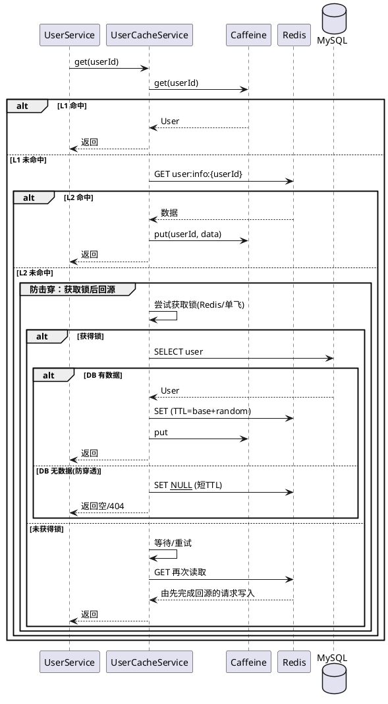
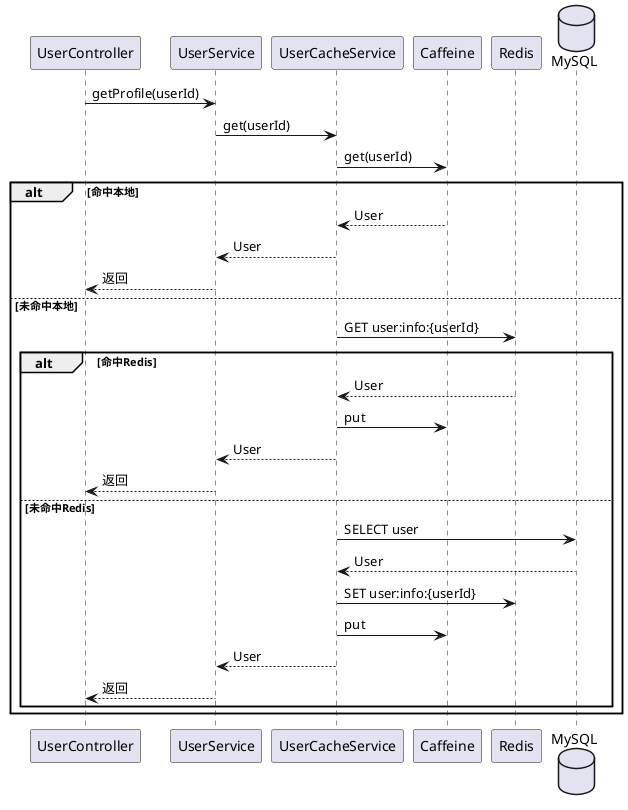
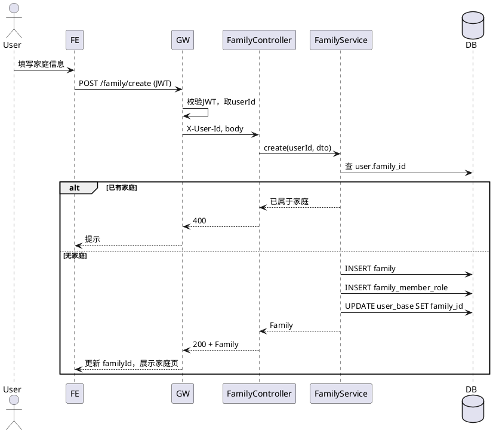
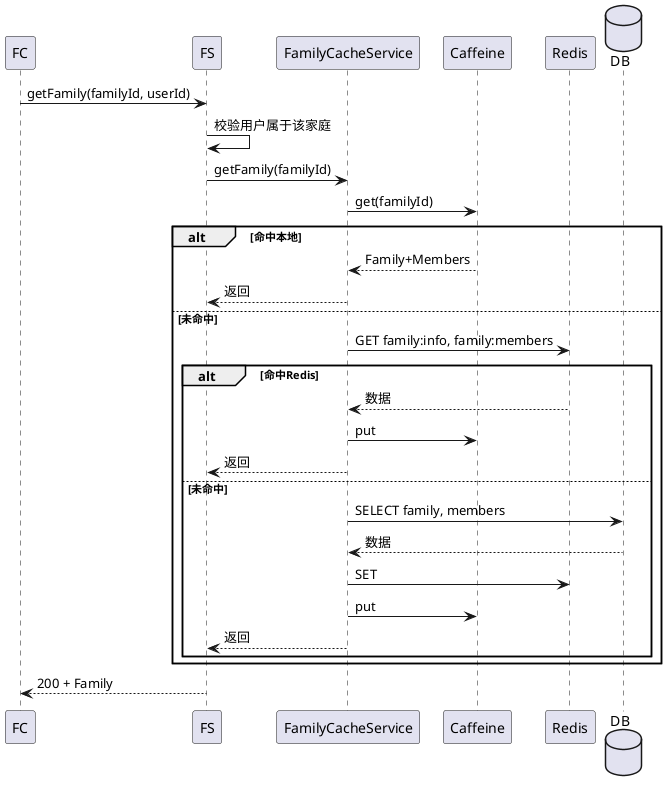

# 迭代二详细设计

## 一、迭代目标与范围

### 1.1 目标

在迭代一（注册登录骨架）基础上，完成**用户信息维护**与**家庭管理**闭环：支持用户查看/编辑个人信息、创建家庭或加入已有家庭、展示家庭信息与成员；并在后端**完善缓存策略**（用户与家庭信息）：实现本地（Caffeine）→ Redis → MySQL 三级缓存、统一 Key/TTL/失效规范，以及防击穿、防穿透、防雪崩的完整方案，为后续财富与高并发场景打基础。

### 1.2 范围

| 类别     | 内容 |
|----------|------|
| 前端     | 个人信息页（/profile）查看与编辑；家庭页（/family）创建家庭/加入家庭、家庭地址编辑、成员列表展示；主布局与导航完善；authStore 扩展（含 familyId、家庭信息）；familyStore 状态与家庭相关 API |
| 后端     | 用户信息查询/更新接口；家庭 CRUD、创建家庭/加入家庭、家庭成员与角色；Gateway 增加 JWT 校验并将 userId/familyId 注入请求头；auth-user-service 内完善 Caffeine + Redis 三级缓存及完整缓存策略 |
| 数据与缓存 | family、family_member_role 表设计与建表；user_base 的 family_id 使用；**完善缓存策略**：Key 规范、TTL 与随机偏移、读/写流程、失效矩阵、防击穿/穿透/雪崩实现要点与配置 |

### 1.3 不纳入本迭代

- 财富相关功能（账户、资产汇总、趋势）
- 用户分表、家庭分表实现
- 监控与日志体系

---

## 二、前端详细设计

### 2.1 在迭代一基础上的新增/变更

- **路由**：新增 `/profile`、`/family`；`/dashboard` 可展示简要家庭与个人概览（占位亦可）。
- **布局**：MainLayout 提供主导航（概览、个人信息、家庭、后续财富入口占位）。
- **状态**：authStore 增加 `familyId`、可选 `familyInfo`；新增 familyStore（当前家庭详情、成员列表）。

### 2.2 路由设计（迭代二完整）

| 路径        | 组件        | 说明           | 是否需要登录 |
|-------------|-------------|----------------|--------------|
| `/login`    | Login       | 登录页         | 否           |
| `/register` | Register    | 注册页         | 否           |
| `/`         | 重定向      | 已登录 → `/dashboard`，未登录 → `/login` | - |
| `/dashboard` | Dashboard | 概览页（可展示欢迎 + 家庭/个人简要信息） | 是 |
| `/profile`  | Profile     | 用户个人信息查看与编辑 | 是 |
| `/family`   | Family      | 家庭信息、成员、创建/加入家庭 | 是 |

- **导航守卫**：与迭代一一致；访问 `/profile`、`/family`、`/dashboard` 未登录时重定向至 `/login`。

### 2.3 个人信息页（/profile）

- **展示**
  - 用户名、生日、邮箱、手机（只读或可编辑，按产品约定）；所属家庭名称/别名（只读，来自 familyStore 或接口）。
- **编辑**
  - 可编辑字段：生日、邮箱、手机（用户名一般不允许改）；提交调用 `PUT /user/profile` 或 `PATCH /user/profile`。
- **行为**
  - 进入页时若未拉取最新用户信息，可调 `GET /user/profile` 或使用 authStore 中已有信息；保存成功后更新 authStore 并提示。
- **校验**：邮箱、手机格式；生日合法性。

### 2.4 家庭页（/family）

- **状态区分**
  - **未加入家庭**：展示「创建家庭」与「加入家庭」入口。
    - 创建家庭：表单（家庭别名、国家、省份、城市、街道）；提交 `POST /family/create`，成功后更新 authStore.familyId 与 familyStore，并刷新页面展示家庭信息。
    - 加入家庭：输入家庭邀请码或家庭 ID（若后端支持）；提交 `POST /family/join`，成功后同上。
  - **已加入家庭**：展示当前家庭信息（别名、国家、省、市、街道）、成员列表（昵称/用户名、角色、加入时间）；提供「编辑家庭地址」入口。
- **编辑家庭地址**
  - 表单同创建时的地址字段；提交 `PUT /family/{familyId}` 或 `PATCH /family/address`，成功后更新 familyStore。
- **成员列表**
  - 表格或列表：成员标识、角色（丈夫/妻子/子女/其他）、加入时间；仅展示，本迭代不做踢人/改角色（可预留接口）。

### 2.5 状态管理

#### 2.5.1 authStore 扩展

- **状态**
  - 在迭代一基础上增加：`familyId: string | null`；可选 `familyName?: string`（便于导航展示）。
- **方法**
  - 登录/注册返回中若包含 `familyId`，则写入 authStore；`loadFromStorage()` 时一并恢复。
  - 创建/加入家庭成功后，由调用方或 familyStore 回调更新 `familyId`（及可选 familyName）。

#### 2.5.2 familyStore（新增）

- **状态**
  - `family: { id, nameAlias, country, province, city, street, ... } | null`
  - `members: Array<{ userId, username, role, joinedAt }>`
- **方法**
  - `fetchFamily(familyId)`：调用 `GET /family/{familyId}`，写入 family、members。
  - `createFamily(payload)`：调用 `POST /family/create`，成功后更新 state 并可选更新 authStore。
  - `joinFamily(inviteCodeOrId)`：调用 `POST /family/join`，成功后同上。
  - `updateFamilyAddress(familyId, payload)`：调用 `PUT /family/{familyId}` 或 PATCH，成功后更新 family。

### 2.6 接口封装（新增）

- **user API**：`getProfile()` → `GET /user/profile`；`updateProfile(body)` → `PUT /user/profile`。请求头由 Axios 拦截器统一带 JWT。
- **family API**：`getFamily(familyId)`、`createFamily(body)`、`joinFamily(inviteCodeOrId)`、`updateFamily(familyId, body)`，对应后端 REST；需登录。

### 2.7 类型定义（示例）

```ts
// types/user.d.ts
export interface UserProfile {
  id: string;
  username: string;
  birthday?: string;
  email?: string;
  phone?: string;
  familyId?: string | null;
}

export interface UserProfileUpdateRequest {
  birthday?: string;
  email?: string;
  phone?: string;
}

// types/family.d.ts
export interface FamilyInfo {
  id: string;
  nameAlias: string;
  country: string;
  province: string;
  city: string;
  street: string;
}

export interface FamilyMember {
  userId: string;
  username: string;
  role: string;  // HUSBAND | WIFE | CHILD | OTHER
  joinedAt: string;
}

export interface FamilyCreateRequest {
  nameAlias: string;
  country: string;
  province: string;
  city: string;
  street: string;
}

export interface FamilyJoinRequest {
  inviteCode?: string;  // 或 familyId，按后端约定
}
```

### 2.8 目录结构（迭代二新增/变更）

```
house-hold-web/src/
├── api/
│   ├── request.ts
│   ├── auth.ts
│   ├── user.ts      # 新增：getProfile, updateProfile
│   └── family.ts    # 新增：getFamily, createFamily, joinFamily, updateFamily
├── stores/
│   ├── auth.ts      # 扩展 familyId、familyName
│   └── family.ts    # 新增
├── views/
│   ├── Login.vue
│   ├── Register.vue
│   ├── Dashboard.vue  # 可完善：欢迎 + 家庭/个人摘要
│   ├── Profile.vue    # 新增
│   └── Family.vue     # 新增
├── types/
│   ├── auth.d.ts
│   ├── user.d.ts     # 新增
│   └── family.d.ts   # 新增
└── ...
```

---

## 三、后端详细设计

### 3.1 本迭代涉及模块

- **house-hold-gateway**：增加 JWT 校验（除 `/auth/login`、`/auth/register` 外）；校验通过后将 `userId`、`familyId`（若有）注入请求头（如 `X-User-Id`、`X-Family-Id`）转发下游。
- **house-hold-auth-user**：用户信息查询/更新；家庭 CRUD、创建家庭、加入家庭、家庭成员与角色；接入 Caffeine + Redis 缓存（用户、家庭信息）。

### 3.2 Gateway 变更

- **路由**（在迭代一基础上）：
  - `/auth/**` → auth-user（登录/注册不校验 JWT）
  - `/user/**` → auth-user（需 JWT）
  - `/family/**` → auth-user（需 JWT）
- **鉴权**：
  - 请求头 `Authorization: Bearer <token>`；Gateway 解析 JWT，校验签名与过期时间。
  - 解析出的 `userId`（及可选 `familyId`）放入请求头 `X-User-Id`、`X-Family-Id` 转发至 auth-user。
  - 无 token 或无效 token 访问 `/user/**`、`/family/**` 返回 401。

### 3.3 auth-user-service 详细设计

#### 3.3.1 包结构（迭代二新增）

```
house-hold-auth-user/
├── controller/
│   ├── AuthController.java      # 迭代一已有
│   ├── UserController.java     # 新增：GET/PUT /user/profile
│   └── FamilyController.java   # 新增：家庭 CRUD、create、join
├── service/
│   ├── AuthService.java
│   ├── UserService.java        # 新增：用户信息查询/更新，可带缓存
│   └── FamilyService.java      # 新增：家庭与成员，可带缓存
├── mapper/
│   ├── UserMapper.java
│   ├── FamilyMapper.java       # 新增
│   └── FamilyMemberRoleMapper.java  # 新增
├── entity/
│   ├── User.java
│   ├── Family.java             # 新增
│   └── FamilyMemberRole.java   # 新增
├── dto/ ...
├── config/
│   ├── JwtConfig.java
│   └── CacheConfig.java        # 新增：Caffeine + Redis 配置
├── cache/                       # 新增：缓存封装
│   ├── UserCacheService.java   # 用户信息查缓存、写缓存、失效
│   └── FamilyCacheService.java # 家庭信息、成员列表缓存
└── ...
```

#### 3.3.2 用户信息接口

- **GET /user/profile**
  - 从请求头 `X-User-Id` 取当前用户；先查缓存（见 3.4），未命中再查 DB；返回用户信息（不含 password_hash）；可写入缓存。
- **PUT /user/profile**
  - 请求体：可修改字段（生日、邮箱、手机）；更新 DB 后失效对应用户缓存（并可选更新 Redis/本地缓存）。

#### 3.3.3 家庭接口

- **POST /family/create**
  - 请求头 `X-User-Id`；请求体：家庭别名、国家、省、市、街道。
  - 逻辑：若用户已有 family_id，可返回 4xx「已属于某家庭」；否则插入 family 表，插入 family_member_role（当前用户，角色可默认如 OWNER 或 HUSBAND），更新 user_base.family_id；失效/不缓存新数据直至下次查询；返回家庭信息。
- **POST /family/join**
  - 请求体：邀请码或 familyId（按产品约定）；校验家庭存在且未满等；插入 family_member_role，更新 user_base.family_id；返回家庭信息；失效相关缓存。
- **GET /family/{familyId}**
  - 校验当前用户属于该家庭（通过 family_member_role 或 user.family_id）；先查缓存，未命中查 DB；返回家庭基本信息 + 成员列表。
- **PUT /family/{familyId}**
  - 更新家庭地址（别名、国家、省、市、街道）；校验当前用户属于该家庭；更新 DB 后失效 family 缓存。

#### 3.3.4 数据访问与校验

- 所有需登录接口从 Gateway 注入的 `X-User-Id` 取当前用户；家庭相关接口校验「当前用户属于该 familyId」再允许读写。
- 用户只能归属一个家庭：创建/加入前检查 `user.family_id` 是否已存在。

### 3.4 缓存策略（完善）

本迭代在 auth-user-service 内对**用户信息**与**家庭信息**实现完整三级缓存策略，并与 README 概要设计中的「缓存与存储」保持一致。

#### 3.4.1 三级缓存整体策略

- **L1 本地缓存（Caffeine）**：进程内，响应最快，仅能缓存当前实例热点数据；用于热点用户、热点家庭与成员。
- **L2 分布式缓存（Redis）**：多实例共享，解决本地缓存不一致与容量限制；用于所有已加载过的用户/家庭数据。
- **L3 数据源（MySQL）**：最终一致性的来源，未命中 L1/L2 时回源并回种缓存。

**读路径**：L1 → L2 → L3；每级命中则返回，未命中则下沉并回种上游（回种 L2 时同时回种 L1）。  
**写路径**：先写 DB，再按「失效矩阵」删除或更新对应 Key，保证后续读到的为最新数据。

#### 3.4.2 缓存 Key 规范（迭代二）

| 业务       | Key 格式                  | 值说明               | 建议 TTL（Redis）     |
|------------|---------------------------|----------------------|------------------------|
| 用户信息   | `user:info:{userId}`      | 用户概要（不含密码） | 见 3.4.4 TTL 与雪崩   |
| 家庭信息   | `family:info:{familyId}`  | 家庭基本信息         | 同上                   |
| 家庭成员   | `family:members:{familyId}` | 成员列表           | 同上                   |
| 空值占位   | 同上                      | 特殊标记（如 `__NULL__`） | 短 TTL，见 3.4.6 穿透 |

- **Key 命名空间**：建议统一前缀（如 `household:auth:`），便于按业务清理与监控，例如 `household:auth:user:info:{userId}`。
- **序列化**：Redis 使用 JSON 或统一序列化方式；Caffeine 存 Java 对象即可；注意不缓存敏感字段（如 password_hash）。

#### 3.4.3 读路径详细流程（含回种）

1. **L1（Caffeine）**：`CacheService.getUser(userId)` 先查本地；命中则直接返回。
2. **L2（Redis）**：未命中则查 Redis；命中则反序列化、回种 L1（使用本地 TTL）、返回。
3. **L3（DB）**：未命中则查 DB。
   - 若查到：写入 Redis（TTL 带随机偏移）、回种 L1、返回。
   - 若未查到（如非法 userId/familyId）：按「防穿透」策略写 Redis 空值占位（短 TTL）、**不**回种 L1，返回业务空或 404。

家庭信息与成员列表的读路径同理：先 L1（可按 `family:info`、`family:members` 分 key 或合并为一个本地 key），再 L2，再 DB；回种时两个 Redis Key 均需写入并回种 L1。

#### 3.4.4 TTL 与防雪崩

- **基准 TTL（可配置）**  
  - Redis：用户/家庭/成员建议基准 30 分钟（如 `cache.ttl.redis.user=1800`）。  
  - Caffeine：建议 5 分钟（如 `cache.ttl.local=300`），避免本地与 Redis 长期不一致。
- **随机偏移（防雪崩）**  
  - Redis 实际 TTL = `baseTtlSeconds + random(0, ttlRandomMax)`，例如 `baseTtlSeconds=1800`、`ttlRandomMax=300`，则 TTL 落在 [1800, 2100] 秒，避免大量 Key 同时过期导致流量打到 DB。
- **配置项示例**（见 3.5）：`cache.ttl.redis.user`、`cache.ttl.redis.family`、`cache.ttl.redis.random-max`、`cache.ttl.local`。

#### 3.4.5 防击穿（热点 Key 回源互斥）

- **问题**：热点 Key 过期瞬间大量请求同时回源 DB，造成击穿。
- **方案**：回源前加互斥，只允许一个请求（或单实例一个请求）回源，其余等待或短暂轮询后复用结果。
  - **Redis 分布式锁**：锁 Key 如 `lock:user:info:{userId}`，使用 SET NX + 过期时间（如 10 秒）；获取锁成功则回源并写缓存，失败则等待后重试读缓存（或短暂 sleep 再读 Redis）。
  - **单飞（Single Flight）**：同一 JVM 内对同一 Key 的并发请求合并为一次回源（如 Guava Cache 的 `CacheLoader` 并发只触发一次 load），再统一回种 Redis + Caffeine。迭代二至少实现「单实例内单飞」或「Redis 锁」其一，推荐单实例单飞 + Redis 锁（多实例时防击穿）。
- **实现要点**：回源完成后必须先写 Redis 再释放锁；锁过期时间要大于单次 DB 查询时间，避免死锁。

#### 3.4.6 防穿透（不存在的数据）

- **问题**：恶意或异常请求大量访问不存在的 userId/familyId，每次都穿透到 DB。
- **方案**  
  - **空值占位**：DB 未命中时，在 Redis 中写入约定好的空值标记（如字符串 `__NULL__` 或专用 JSON），并设置**短 TTL**（如 1–2 分钟，可配置 `cache.ttl.null-placeholder=120`）；后续相同请求在 L2 命中空值后直接返回业务空/404，不再打 DB。  
  - **不回种 L1**：空值占位仅写 Redis，不写入 Caffeine，避免本地缓存大量无效 Key。  
  - **参数校验**：接口层对 userId、familyId 做格式与合法性校验（如必填、数字/长整型），非法请求直接 400，不进入缓存层。  
- **可选（后续迭代）**：对 userId/familyId 使用布隆过滤器，先过滤明显不存在的 id，再查缓存/DB。

#### 3.4.7 写路径与失效矩阵

所有**写操作**（DB 变更）必须在事务提交后，按下列矩阵失效或更新缓存，保证读到的数据与 DB 一致。

| 操作               | 需失效的 Redis Key                          | 需失效的 Caffeine Key（本实例）     |
|--------------------|---------------------------------------------|-------------------------------------|
| 更新用户信息       | `user:info:{userId}`                        | 同上                                |
| 创建家庭           | 无（新 Key 尚未被缓存）；可选失效该用户的 `user:info:{userId}`（因 familyId 变化） | 同上                                |
| 加入家庭           | `user:info:{userId}`；`family:members:{familyId}` | 同上；`family:info:{familyId}`、`family:members:{familyId}` |
| 更新家庭地址       | `family:info:{familyId}`                     | `family:info:{familyId}`、`family:members:{familyId}`（若本地按 family 缓存） |

- **失效方式**：以 **delete** 为主（删除 Key），不做先读后改；避免并发下覆盖回旧数据。  
- **多实例**：只删除 Redis 即可，各实例 Caffeine 在 TTL 内会过期；若需即时生效，可考虑 Redis 发布订阅通知各实例删除本地 Key（迭代二可选）。

#### 3.4.8 缓存层实现约定（包结构）

- **CacheConfig**：加载 Caffeine 的 maxSize、expireAfterWrite；Redis 的 TTL 与 randomMax；缓存总开关（如 `cache.enabled=true/false`）；空值占位 TTL。
- **UserCacheService**：`get(userId)`（按 3.4.3 读路径）、`invalidate(userId)`（写路径失效）；内部封装 L1/L2 与防击穿/穿透/雪崩逻辑。
- **FamilyCacheService**：`getFamily(familyId)`、`getMembers(familyId)` 或合并为 `getFamilyWithMembers(familyId)`；`invalidateFamily(familyId)`（同时失效 info + members）；同样封装 L1/L2 与三防。
- **Single Flight / 分布式锁**：可在 `cache/support` 下实现 `LoadLock` 或使用 Redis 锁工具，由 UserCacheService/FamilyCacheService 在回源前调用。

#### 3.4.9 缓存策略流程图（读路径，用户信息）



### 3.5 配置（Nacos / 本地）

auth-user-service 中与缓存相关的配置建议统一放在 Nacos（如 `house-hold-auth-user.yaml`）或本地 `application.yml`，便于按环境调整：

| 配置项 | 说明 | 示例值 |
|--------|------|--------|
| `spring.data.redis.host` / `port` / `password` | Redis 连接 | 若迭代一未配置则本迭代必配 |
| `cache.enabled` | 是否启用多级缓存（关则直查 DB） | true |
| `cache.local.enabled` | 是否启用 Caffeine | true |
| `cache.local.max-size` | Caffeine 最大条目数 | 1000 |
| `cache.ttl.local-seconds` | Caffeine TTL（秒） | 300 |
| `cache.ttl.redis-user-seconds` | 用户信息 Redis 基准 TTL | 1800 |
| `cache.ttl.redis-family-seconds` | 家庭/成员 Redis 基准 TTL | 1800 |
| `cache.ttl.redis-random-max` | TTL 随机偏移上限（秒） | 300 |
| `cache.ttl.null-placeholder-seconds` | 空值占位 TTL（防穿透） | 120 |
| `cache.key-prefix` | Redis Key 统一前缀 | household:auth: |
| `cache.lock.user.timeout-seconds` | 用户缓存回源锁超时（防击穿） | 10 |

- 联调或排查问题时可将 `cache.enabled` 设为 false，或仅关闭 `cache.local.enabled`，便于对比行为。

---

## 四、接口契约（迭代二）

### 4.1 用户信息

#### 4.1.1 获取当前用户信息

- **请求**：`GET /user/profile`  
- **请求头**：`Authorization: Bearer <token>`
- **Response 200**

| 字段      | 类型   | 说明 |
|-----------|--------|------|
| id        | string | 用户 ID |
| username  | string | 用户名 |
| birthday  | string | 生日 YYYY-MM-DD |
| email     | string | 邮箱（可选） |
| phone     | string | 手机（可选） |
| familyId  | string | 所属家庭 ID，未加入则 null |

- **错误**：401 未登录或 token 无效。

#### 4.1.2 更新当前用户信息

- **请求**：`PUT /user/profile`  
- **Request Body（JSON）**

| 字段     | 类型   | 必填 | 说明 |
|----------|--------|------|------|
| birthday | string | 否   | YYYY-MM-DD |
| email    | string | 否   | 邮箱 |
| phone    | string | 否   | 手机 |

- **Response 200**：与 GET /user/profile 结构一致（返回更新后信息）。
- **错误**：400 参数不合法；401 未登录。

### 4.2 家庭

#### 4.2.1 创建家庭

- **请求**：`POST /family/create`  
- **Request Body（JSON）**

| 字段      | 类型   | 必填 | 说明 |
|-----------|--------|------|------|
| nameAlias | string | 是   | 家庭别名 |
| country   | string | 是   | 国家 |
| province  | string | 是   | 省份 |
| city      | string | 是   | 城市 |
| street    | string | 是   | 街道 |

- **Response 200**：返回家庭对象（id, nameAlias, country, province, city, street）及可选成员列表。
- **错误**：400 已属于某家庭；401 未登录。

#### 4.2.2 加入家庭

- **请求**：`POST /family/join`  
- **Request Body（JSON）**（按后端约定二选一或兼容）

| 字段       | 类型   | 必填 | 说明 |
|------------|--------|------|------|
| inviteCode | string | 否   | 邀请码 |
| familyId   | string | 否   | 家庭 ID（若未采用邀请码） |

- **Response 200**：返回家庭对象及成员列表。
- **错误**：400 家庭不存在或已在该家庭；401 未登录。

#### 4.2.3 获取家庭信息（含成员）

- **请求**：`GET /family/{familyId}`  
- **Response 200**

| 字段   | 类型   | 说明 |
|--------|--------|------|
| id     | string | 家庭 ID |
| nameAlias | string | 家庭别名 |
| country | string | 国家 |
| province | string | 省份 |
| city   | string | 城市 |
| street | string | 街道 |
| members | array  | 成员列表 |
| members[].userId | string | 用户 ID |
| members[].username | string | 用户名 |
| members[].role | string | 角色 HUSBAND/WIFE/CHILD/OTHER |
| members[].joinedAt | string | 加入时间 |

- **错误**：403 不属于该家庭；404 家庭不存在；401 未登录。

#### 4.2.4 更新家庭地址

- **请求**：`PUT /family/{familyId}`  
- **Request Body（JSON）**：与创建家庭地址字段一致（nameAlias, country, province, city, street），可部分更新（PATCH 语义）或全量。
- **Response 200**：返回更新后的家庭对象。
- **错误**：403 不属于该家庭；404 家庭不存在；401 未登录。

### 4.3 统一错误响应格式

与迭代一一致，如：`{ "code": "ERROR_CODE", "message": "提示信息" }`。

---

## 五、数据库设计（迭代二）

### 5.1 家庭表 family

| 字段名     | 类型         | 说明 |
|------------|--------------|------|
| id         | BIGINT       | 主键 |
| name_alias | VARCHAR(64)  | 家庭别名 |
| country    | VARCHAR(64)  | 国家 |
| province   | VARCHAR(64)  | 省份 |
| city       | VARCHAR(64)  | 城市 |
| street     | VARCHAR(256) | 街道 |
| created_at | DATETIME     | 创建时间 |
| updated_at | DATETIME     | 更新时间 |

### 5.2 家庭成员角色表 family_member_role

| 字段名     | 类型        | 说明 |
|------------|-------------|------|
| id         | BIGINT      | 主键 |
| user_id    | BIGINT      | 用户 ID，FK → user_base.id |
| family_id  | BIGINT      | 家庭 ID，FK → family.id |
| role       | VARCHAR(32) | 角色：HUSBAND, WIFE, CHILD, OTHER 等 |
| joined_at  | DATETIME    | 加入时间 |
| created_at | DATETIME    | 创建时间 |

- **唯一约束**：(user_id, family_id) 唯一；一个用户在一个家庭只一条记录。
- **索引**：family_id 用于查成员列表；user_id 用于查用户所属家庭。

### 5.3 用户表 user_base（迭代一已有，本迭代使用 family_id）

- 确保 `family_id` 有索引，便于「查某家庭下成员」时与 family_member_role 联合使用（或仅通过 family_member_role 查成员，user_base.family_id 用于快速判断当前用户所属家庭）。

### 5.4 建表 SQL 示例（MySQL）

```sql
CREATE TABLE family (
  id BIGINT PRIMARY KEY COMMENT '家庭ID',
  name_alias VARCHAR(64) NOT NULL COMMENT '家庭别名',
  country VARCHAR(64) NOT NULL DEFAULT '' COMMENT '国家',
  province VARCHAR(64) NOT NULL DEFAULT '' COMMENT '省份',
  city VARCHAR(64) NOT NULL DEFAULT '' COMMENT '城市',
  street VARCHAR(256) NOT NULL DEFAULT '' COMMENT '街道',
  created_at DATETIME DEFAULT CURRENT_TIMESTAMP COMMENT '创建时间',
  updated_at DATETIME DEFAULT CURRENT_TIMESTAMP ON UPDATE CURRENT_TIMESTAMP COMMENT '更新时间'
) ENGINE=InnoDB DEFAULT CHARSET=utf8mb4 COMMENT='家庭表';

CREATE TABLE family_member_role (
  id BIGINT PRIMARY KEY COMMENT '主键',
  user_id BIGINT NOT NULL COMMENT '用户ID',
  family_id BIGINT NOT NULL COMMENT '家庭ID',
  role VARCHAR(32) NOT NULL DEFAULT 'OTHER' COMMENT '角色:HUSBAND,WIFE,CHILD,OTHER',
  joined_at DATETIME DEFAULT CURRENT_TIMESTAMP COMMENT '加入时间',
  created_at DATETIME DEFAULT CURRENT_TIMESTAMP COMMENT '创建时间',
  UNIQUE KEY uk_user_family (user_id, family_id),
  KEY idx_family_id (family_id),
  KEY idx_user_id (user_id)
) ENGINE=InnoDB DEFAULT CHARSET=utf8mb4 COMMENT='家庭成员角色表';
```

---

## 六、流程说明（PlantUML）

### 6.1 获取用户信息（带缓存）



### 6.2 创建家庭



### 6.3 获取家庭信息（带缓存）



---

## 七、验收与联调要点

- **前端**：登录后能进入个人信息页并正确展示/编辑；未加入家庭时家庭页展示创建/加入，创建或加入后展示家庭信息与成员；主布局导航正确；familyId 在登录态与创建/加入后正确反映在 authStore。
- **后端**：Gateway 对 `/user/**`、`/family/**` 校验 JWT 并注入 X-User-Id；用户信息、家庭信息接口按契约返回；创建家庭后 user.family_id 与 family_member_role 正确；加入家庭逻辑正确；缓存命中时能返回正确数据，更新用户/家庭后再次请求能拿到最新数据（缓存失效正确）。
- **联调**：所有需登录接口带 token；错误码与文档一致；CORS 与迭代一保持一致。

---

## 八、附录：迭代二交付清单

| 序号 | 交付物 | 说明 |
|------|--------|------|
| 1 | 前端：Profile、Family 页与 familyStore、user/family API | 个人信息维护、家庭创建/加入、家庭信息与成员展示 |
| 2 | Gateway：JWT 校验与 X-User-Id/X-Family-Id 注入 | 除登录/注册外需鉴权 |
| 3 | auth-user：UserController、FamilyController 及 Service/Mapper | 用户信息、家庭 CRUD、创建/加入 |
| 4 | **缓存策略实现**：CacheConfig、UserCacheService、FamilyCacheService | 三级缓存读路径；TTL+随机偏移；防击穿（锁/单飞）、防穿透（空值占位）、防雪崩；写路径失效矩阵 |
| 5 | 数据库：family、family_member_role 表 DDL | 与文档一致 |
| 6 | 接口文档片段 | 用户信息、家庭相关接口请求/响应及错误码 |
| 7 | 迭代二详细设计.md | 本文档（含完善缓存策略章节） |
